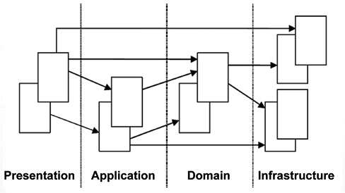
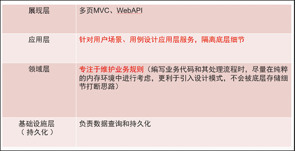

# 领域驱动设计架构 (DDD)

## 展现层 (Presentation)

向用户提供一个接口，使用应用层来和用户进行交互，也就是我们当前项目的 Web 单层。

## 应用层 (Application)

是展现层和领域层能够实现交互的中间者，协调业务对象去执行特定的应用任务，可以理解复杂业务逻辑直接的功能拼接。

## 领域层 (Domain)

包括业务对象和业务规则，这是应用程序的核心层，用于存放领域实体及重要逻辑的实现。

## 基础设施层 (Infrastructure)

提供通用技术来支持更高的层。比如，基础设施层的仓储 (Repository)可通过 ORM 来实现数据库交互，或者提供发送邮件的支持，即当前的 DataRepositories 文件夹中的仓储服务，关于仓储服务将在后面为读者讲解。

