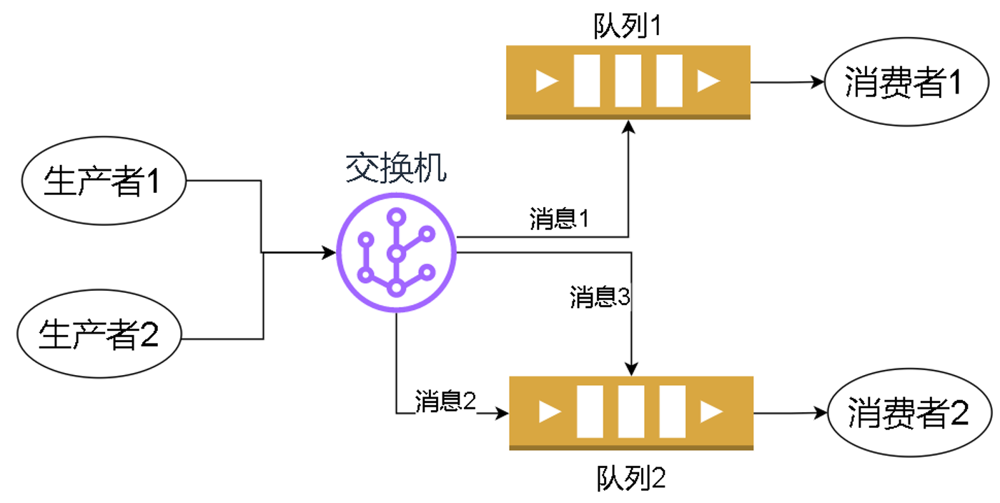

# RabbitMQ 的基本概念

集成事件是服务器间的通信, 所以必须借助于第三方服务器作为事件总线

常用的消息中间件有 Redis, RabbitMQ, Kafka, ActiveMQ 等

## 信道 (Channel)

信道是消息的生产者, 消费者和服务器进行通信的虚拟连接. TCP 连接的建立是非常消耗资源的, 所以 RabbitMQ 在 TCP 连接的基础上构建了虚拟的信道. 我们尽量重复使用 TCP 连接, 而信道则是可以用完了就关闭

## 队列 (Queue)

用来进行消息收发的地方, 生产者把消息放到队列中, 消费者从队列中获取数据

## 交换机 (exchange)

把消息路由到一个或者多个队列中

## RabbitMQ 的 routing 模式

生产者把消息发布到交换机中, 消息携带一个 routingKey 属性, 交换机会根据 routingKey 的值把消息发送到一个或者多个队列

消费者会从队列中获取消息

交换机和队列都位于 RabbitMQ 服务器内部

优点: 即使消费者不在线, 消费者相关的消息也会被保存到队列中, 当消费者上线之后, 消费者就可以获取到离线期间错过的消息
